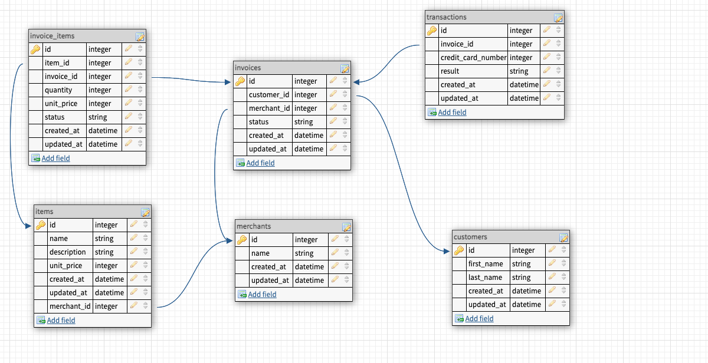

# Little Esty Shop

## Background and Description

"Little Esty Shop" is a group project that requires students to build a fictitious e-commerce platform where merchants and admins can manage inventory and fulfill customer invoices.


## Goals accomplished 
- Setup normalized database with one to many and many to many relationships
- Setup custom rake task to seed the database
- Utilize advanced active record techniques to perform complex database queries
- Created a service class and poros search to consume GitHub API
- Webmock is used to mock API tests
- Multiple edge cases were added to enhance testing
- Added view methods in application helper to declutter view calls 
- Deployed application to [Heroku](https://gentle-forest-90792.herokuapp.com/)

## Setup
This project requires Ruby 2.5.3.  
This project requires Rails 5.2.3 and later  
1. Clone this repository
```
git clone https://github.com/cunninghamge/little-esty-shop
```
2. Install dependencies
```
bundle install
```
Note: you will need to install gem install bundler if you don't have bundler  
3. Database setup
```
rails db:setup
rake csv_load:all
```
## Usage
Check functionalities with 
```
bundle exec rspec
```
Navigate local host with 
```
rails server
```

## Database Scheme


## Technologies
- Ruby
- Ruby on Rails
### Utilities
- rspec-rails
- factory_bot_rails
- faker
- simplecov
- webmock


## Project details 
From [Turing School](https://github.com/turingschool-examples/little-esty-shop)

## Contributors
[Gus Cunningham](https://github.com/cunninghamge)
[Grayson Myers](https://github.com/GrayMyers)
[Max Ribbans](https://github.com/ribbansmax)
[Joe Jiang](https://github.com/ninesky00)
